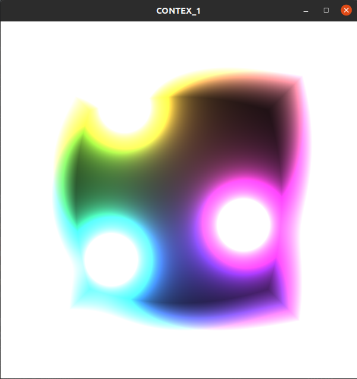
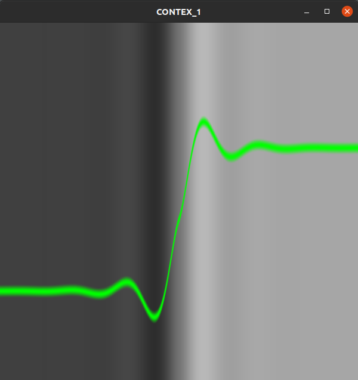

# MyFragmentsLoader
My Utility for learn OpenGl stuff with [thebookofshaders](https://thebookofshaders.com/) and [shadertoy](https://www.shadertoy.com)
--------

It can load *multiple fragment shaders with one vertex shader in common*.   
You can select the current fragment to display and when you edit the fragment source code, current or not, the application reload the associated program.   

For example :   
You can start the application like ``./MyFragmentsLoader -f fragment_folder/ -r -t texture_forder/``  
The application load all fragments and images and you can select the current fragment to display with + or - .
Then you can edit The fragment source code with an editor of your choise, like Visual Studio, and when you save the file ,the application reload the associated program.   
If the compilation is not successiful it will display an ERROR image and the error will be printed on the console.   

PS:   
at the moment the errors are printed on the console, but I have to implement a text system for diplay directly in the error Window.
   

This is a cpp project with Eclipse.  
Required lib :   
* GL
* GLEW
* glfw
* glm
   
also I used [stb_image.h](https://github.com/nothings/stb/blob/master/stb_image.h) for loading the texture images and [easylogging++](https://github.com/amrayn/easyloggingpp) for logger.

