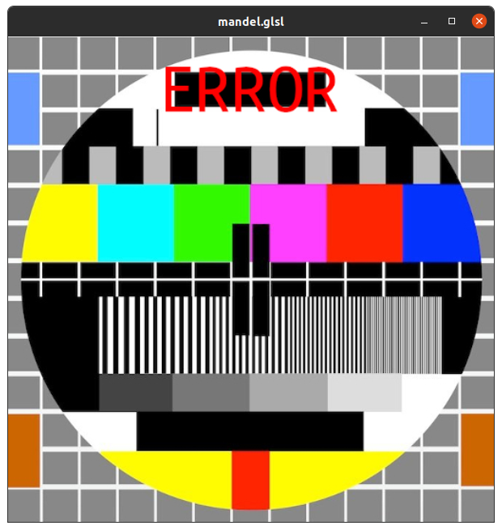
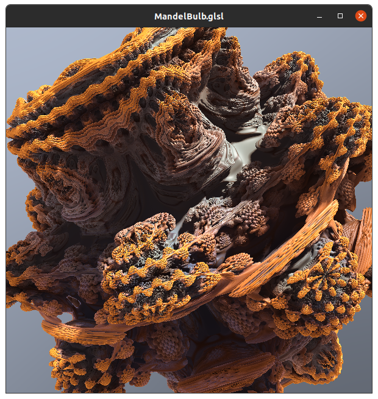

# MyFragmentsLoader
My Utility for learn OpenGl stuff with [thebookofshaders](https://thebookofshaders.com/) and [shadertoy](https://www.shadertoy.com)
--------

The application can load *multiple fragment shaders with one vertex shader in common*.   
You can select the current fragment to display and when you edit the fragment source code, current or not, the application reload the associated program.   

For example :   
You can start the application like ``./MyFragmentsLoader -f example/fragments -r -t example/textures``  
The application load all fragments in the folder `example/fragments` and texture images in the folder `example/textures` and you can select the current fragment to display with <kbd>+</kbd> or <kbd>-</kbd> ,   
then you can edit the fragment source code with an editor of your choise, and when you save the file the application reload the associated program.   
You can use this [fragment shader](https://github.com/musicrizz/MyFragmentsLoader/blob/main/example/fragment_template.glsl) as template.   
If the compilation is not successiful it will display an ERROR image and the errors will be printed on the console.   

PS:   
at the moment the errors are printed on the console, but I have to implement a text system for display directly in the ERROR Window.
   

This is a cpp project with Eclipse.  
Required lib :   
* GL
* GLEW
* glfw
* glm
   
also I used [stb_image.h](https://github.com/nothings/stb/blob/master/stb_image.h) for loading the texture images and [easylogging++](https://github.com/amrayn/easyloggingpp) for logger.

 <video width="600" controls>
  		<source src="readme_res/FragmentLoader.webm" type="video/webm">
</video> 

[example video](readme_res/FragmentLoader.webm) 

